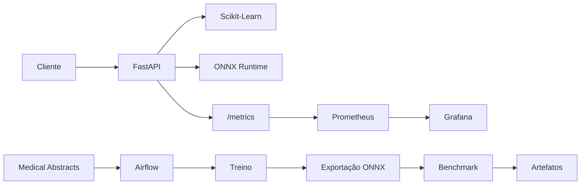

# Medical Triage MLOps

Pipeline de MLOps para classificação de textos médicos, desenvolvido para o Tech
Challenge MLET - Fase 3. O projeto combina modelo Scikit-Learn, inferência otimizada
com ONNX Runtime, API FastAPI, Airflow, GitHub Actions, Prometheus e Grafana.

> **Uso acadêmico:** o sistema não fornece diagnóstico e não substitui avaliação
> profissional. O classificador aprende grupos de condições médicas; a prioridade
> `high/medium/low` é uma regra demonstrativa separada, identificada na resposta como
> `business_rule` e sem validação clínica.

## Resultados reproduzidos

| Indicador | Resultado local |
|---|---:|
| Treino / teste | 11.550 / 2.888 textos |
| Accuracy | 0,5918 |
| F1 macro | 0,5951 |
| Paridade ONNX | 100% em 2.888 textos |
| Diferença máxima de probabilidade | 1,96e-7 |
| Latência p50 | 0,4841 ms -> 0,1352 ms (3,58x) |
| Latência p95 | 0,7139 ms -> 0,2174 ms (3,28x) |
| Latência p99 | 1,0495 ms -> 0,2907 ms (3,61x) |

O benchmark usa 30 execuções de warm-up e 300 medições single-record para cada
runtime no mesmo processo. Números de latência dependem do hardware e devem ser
reexecutados no ambiente da apresentação.

## Arquitetura



- Inferência real-time pela API.
- Treino e otimização batch em DAG separada.
- Modelo carregado uma vez no startup.
- Stack principal pequena: API + Prometheus + Grafana.
- Airflow e Postgres em Compose próprio.
- Dashboard provisionado por JSON, sem configuração manual.

A decisão detalhada para AWS está em [docs/architecture.md](docs/architecture.md).

## Estrutura

```text
.
|-- .github/workflows/ci.yml
|-- airflow/
|   |-- dags/medical_triage_pipeline.py
|   `-- docker-compose.yml
|-- artifacts/
|   |-- model.joblib
|   |-- model.onnx
|   |-- model_metadata.json
|   |-- onnx_metadata.json
|   `-- benchmark.json
|-- monitoring/
|   |-- prometheus.yml
|   `-- grafana/
|-- scripts/generate_traffic.py
|-- src/medical_triage/
|-- tests/
|-- training/
|-- docker-compose.yml
|-- Dockerfile
|-- MODEL_CARD.md
`-- pyproject.toml
```

## Execução rápida

### Requisitos

- Python 3.11 ou 3.12.
- [uv](https://docs.astral.sh/uv/).
- Docker com Compose v2 para a stack completa.

### Ambiente local

```bash
uv sync --extra dev
uv run pytest --cov=medical_triage --cov-report=term-missing
uv run ruff check .
uv run ruff format --check .
```

Os artefatos validados acompanham o repositório. Para reproduzi-los do zero:

```bash
uv run python training/prepare_data.py
uv run python training/train.py --skip-prepare
uv run python training/export_onnx.py --samples 2888
uv run python training/benchmark.py
```

O download é fixado no commit `70a2d9106c724729be8b3c4ddb00d1b14ec300c8`
do dataset e cada arquivo é validado por SHA-256.

### API sem Docker

```bash
uv run uvicorn medical_triage.api:app --host 0.0.0.0 --port 8000
```

Exemplo:

```bash
curl -X POST http://localhost:8000/predict \
  -H "Content-Type: application/json" \
  -d '{"text":"The study describes myocardial injury and cardiovascular risk."}'
```

Resposta resumida:

```json
{
  "condition": "cardiovascular diseases",
  "priority": "low",
  "priority_source": "business_rule",
  "backend": "onnx",
  "model_version": "0.1.0"
}
```

Endpoints:

- `GET /health`: readiness e backend carregado.
- `POST /predict`: classificação e prioridade demonstrativa.
- `GET /metrics`: métricas no formato Prometheus.
- `GET /docs`: documentação OpenAPI.

Se o artefato estiver ausente ou inválido, `/health` retorna estado `degraded` e
`/predict` falha com 503. O serviço não gera uma previsão falsa.

## Docker Compose e observabilidade

```bash
docker compose up --build -d
uv run python scripts/generate_traffic.py --requests 200 --concurrency 10
```

Serviços:

- API: <http://localhost:8000/docs>
- Prometheus: <http://localhost:9090>
- Grafana: <http://localhost:3000> (`admin` / `admin` por padrão local)

O dashboard `Medical Triage API` possui quatro painéis:

1. Taxa de requisições.
2. Latência HTTP p95.
3. Predições por prioridade.
4. Taxa de respostas 5xx.

O texto clínico e a condição prevista não são usados como labels Prometheus.

## Airflow

A DAG executa:

`prepare_data -> train -> export_onnx -> benchmark`

```bash
docker compose -f airflow/docker-compose.yml up airflow-init
docker compose -f airflow/docker-compose.yml up -d
```

A interface fica em <http://localhost:8080>. O usuário e a senha locais padrão são
`admin`; altere-os via `.env` fora de ambiente de demonstração.

## CI/CD

O workflow em `.github/workflows/ci.yml` executa em push e pull request:

- Ruff lint e format check.
- Pytest com gate de cobertura.
- Build real da imagem Docker depois da qualidade passar.

O workflow não publica imagem nem acessa uma conta de nuvem. Uma evolução de CD usaria
GitHub Actions com OIDC, ECR e ECS Fargate, sem chaves AWS permanentes.

## Dataset e alvo

O [Medical Abstracts TC Corpus](https://github.com/sebischair/Medical-Abstracts-TC-Corpus)
é distribuído sob CC BY-SA 3.0 e contém cinco grupos:

- cardiovascular diseases
- digestive system diseases
- general pathological conditions
- neoplasms
- nervous system diseases

Essas classes representam condições, não níveis de urgência. A regra de prioridade
procura termos explícitos de alerta no texto e não usa a condição prevista para decidir
urgência. Essa separação evita apresentar uma transformação arbitrária como ground truth.

Mais detalhes estão no [Model Card](MODEL_CARD.md).

## Validação realizada

Foram executados localmente: download/checksum, treino, testes Python, Ruff, exportação
ONNX, paridade, smoke dos dois backends, validação YAML/JSON e benchmark.

O Docker Desktop foi instalado e a validação real também cobriu a imagem da API, o
Compose com API, Prometheus e Grafana e a DAG completa no Airflow. O run final executou
preparo, treino, exportação ONNX com 2.888 amostras e benchmark. O CI do commit final
passou em lint, testes, cobertura e build Docker.

## Licenças

- Código deste repositório: MIT.
- Medical Abstracts TC Corpus: CC BY-SA 3.0.
- Os dados brutos não são versionados aqui; são baixados da origem fixada.
